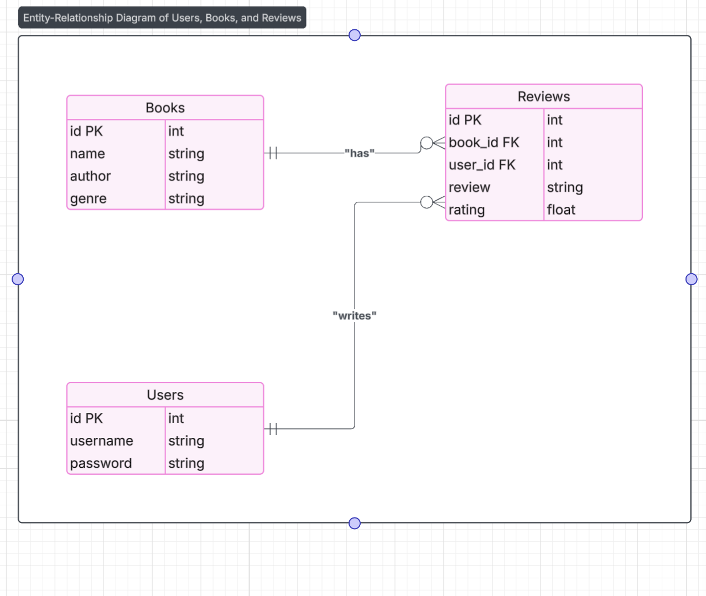

# Billeasy Book Review API

A Node.js-based RESTful API for managing books, reviews, and user authentication. This project allows users to perform CRUD operations on books and reviews, with features like authentication, pagination, and average rating calculation.


## Instruction

1. create a `.env` file in the same level of directory inside this project.

```
ACCESS_TOKEN=2b7d48a26d1ffdffce1364e60f2ed2e3e81a398fc3e1b30bcfaff004c158dfab5f1f55bd90265f31a4e0a2d077798ead7db2157b66db1d75eb77cdea5dc810b3
MYSQL_HOST=127.0.0.1
MYSQL_USER=root
MYSQL_PASSWORD=
MYSQL_DATABASE=billeasy
```

2. Run the following commands in this order only.

```bash
cd billeasy
npm init -y
npm install
npm run dev
```

this will start the server on `PORT=3000`

# API Examples

`POST /signup`

```bash
curl --location '127.0.0.1:3000/signup' \
--header 'Content-Type: application/json' \
--data-raw '{
    "username": "John",
    "password": "admin@123"
}'
```
---

`POST /login`

```bash
curl --location '127.0.0.1:3000/login' \
--header 'Content-Type: application/json' \
--data-raw '{
    "username": "John",
    "password": "admin@123"
}'
```
---
`GET /books`

```bash
curl --location 'http://localhost:3000/books?author=John&genre=Fantasy' \
--header 'Authorization: Bearer <your_token>'
```

`GET /books/:id`

```bash
curl --location 'http://localhost:3000/books/5' \
--header 'Authorization: Bearer <your_token>'
```

`POST /books/:id/reviews`

```bash
curl --location 'http://localhost:3000/books/5/reviews' \
--header 'Authorization: Bearer <your_token>' \
--header 'Content-Type: application/json' \
--data-raw '{
  "review": "Amazing read!",
  "rating": 4.5
}'
```

`PUT /reviews/:id`

```bash
curl --location --request PUT 'http://localhost:3000/reviews/2' \
--header 'Authorization: Bearer <your_token>' \
--header 'Content-Type: application/json' \
--data-raw '{
  "review": "Updated review",
  "rating": 4.0
}'
```

`DELETE /reviews/:id`

```bash
curl --location --request DELETE 'http://localhost:3000/reviews/2' \
--header 'Authorization: Bearer <your_token>'
```


## 🗃️ Database Schema

See schema.sql for full table definitions including:
  * users
  * books
  * reviews (with foreign keys and unique constraints)

  